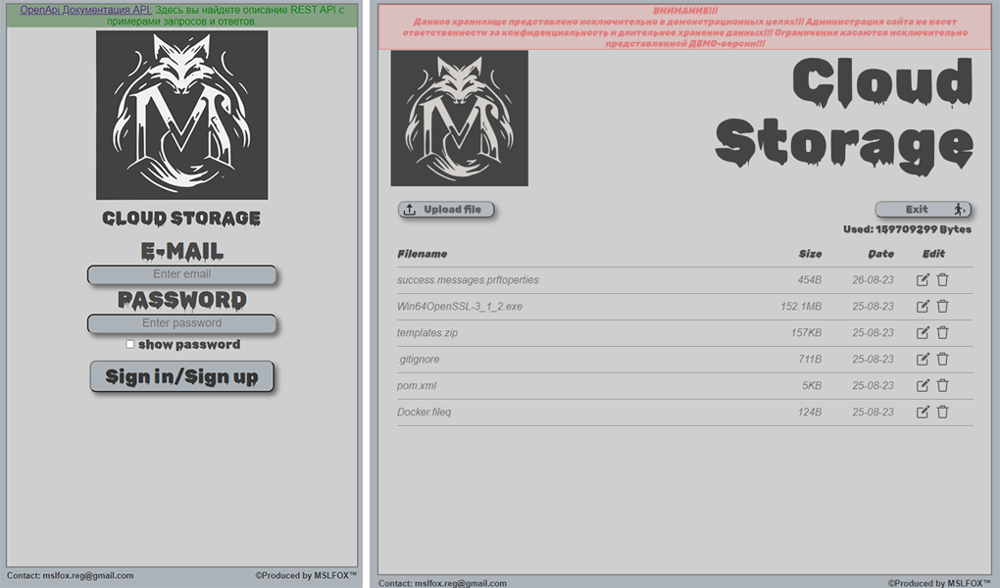

# ***Приложение "CLoud Storage"***  
### *Предназначено для хранения файлов. С регистрацией и аутентификацией пользователей*  
  
## *Ознакомится с работой приложение можно здесь [***CLoud Storage***](https://storage.mslfox.ru) :*  
- ***Front*** _размещен на  хостинге REG.ru поддомен `storage.mslfox.ru`_  
- ***Back***_(файловый сервис и сервис аутентификации)"крутятся" на сервере(Ubuntu) поддомен `storage-api.mslfox.ru`_  
- *Взаимодействие Front и Back по `HTTPS` протоколу*   
- *Cпецификация* ***RESTful API*** [***здесь***](https://storage-api.mslfox.ru/swagger-ui/index.html#)

## **В представленной версии приложения в GitHub:**
[Общие](#общие)  
[Front](#front)  
[Сервис аутентификации](#сервис-аутентификации)  
[JWT токен](#jwt-токен)  
[Файловый сервис и хранение данных](#файловый-сервис-и-хранение-данных)  
[HTTP/HTTPS](#httphttps)  
[Docker](#docker)  
[Тестирование](#тестирование)  
[Технологии](#технологии)
### Общие
- *Cервис аутентификации и файловый сервис и Front, собраны вместе для работы на одном сервере в рамках одного приложения*
- *Аутентификация пользователя происходит по e-mail и паролю.*
- *Регистрация происходит аавтоматически, в случае, если пара логин(E-mail) / пароль, не были использованы ранее.*
### Front
- *файлы* ` *.html, *.js, *.css ` *хранятся в папке `/templates`*
- *для запуска фронта в файле env.js необходимо указать URL адрес сервера `const serverUrl`   (например `const serverUrl = 'http://localhost';`)*
### Сервис аутентификации
- *Аутентификационные данные пользователя хранятся в БД Postgres в зашифрованом виде*
- *Имена пользователей и пароли шифруются перед сохранением в БД*
- *Для аутентификации пользователя, сервис аутентификации получает пару логин/пароль и возвращает клиенту JWT токен,  
который в дальнейшем прикрепляется в заголовоки клиентских запросов, хранится на стороне клиента*
- *В случае выхода пользователя из системы (/logout), JWT сохраняется в "черном списке", что исключает его повторное использование* 
### JWT токен
- *содержит информацию о пользователе, правах пользователя, время жизни токена, выдается при аутентификации через пару логин/парооль*   
__соответствующие настройки можно выбрать в `application.properties`__
```
security.jwt.secret=tmNDKSlBzap3CxsSg0yYffBHF0t8CgnwxZiqI+WBUBPc0kineRBj8jFLI08hNCCj0MmnZq7hIhZaUCjd5Zr0QkjkMKooiOIOIOIKLK
security.jwt.expiration-in-hours=48
```
### Файловый сервис и хранение данных
- *для аутентификации клиента, используется JWT из заголовка запроса, в котором зашифрована информация о пользователе*
- *Файлы пользователей хранятся в файловой системе сервера в специальной отведенной папке*
- *Наименование папок отдельных пользователей шифруются*  
__соответствующие настройки можно выбрать в `application.properties`__
```
file.system.storage.location=uploadStorage
file.system.storage.hash.algorithm=SHA-256
```
### HTTP/HTTPS
- *Микросервис оснащен самоподписным SSL-сертификатом. Может работать как с HTTP, таки с HTTPS протоколами*   
__соответствующие настройки можно выбрать в `application.properties`__
```
# HTTP protocol
server.port=80
# HTTPS protocol
#server.port=443
#server.ssl.enabled=true
#server.ssl.key-store=classpath:keystore/ca.p12
#server.ssl.key-store-password=ca_password
#server.ssl.key-store-type=pkcs12
#server.ssl.key-password=ca_password
```
[4]### Спецификация
<u>***Контроллеры микросервиса оснащены аннотациями OpenApi***</u>
- _для просомтра спецификации RESTful API, `http://${serverUrl}/swagger-ui/index.html#/*`_
- _для просомтра спецификации RESTful API в формате json, `https://${serverUrl}/v3/api-docs/`_

### Docker
<u>___В представленном проекте присутствуют `DockerFile` и `docker-compose.yaml`___</u>  
#### ***Для развертывания приложения из контейнера:***
- **Вариант 1:** *скачать из DockerHub `mslfoxdocker/cloud-storage-api:latest` и `postgres:15.1`.  
Далее запустить docker-compose.yaml c необходимыми настройками HTTP/HTTPS, локального хранилища, БД*
- **Вариант 2:** *Необходимо самостоятельно, при помощи DockerFile, создать образ с именем `mslfoxdocker/cloud-storage-api` либо другим.   
Далее запустить docker-compose.yaml c необходимыми настройками HTTP, локального хранилища, БД.  
При сборке проекта с тестами, возможно понадобится в ручном режиме установить в локальное хранилище образ `testcontainers/ryuk:0.3.3`, если это не роизойдет автоматически  
<u>**При смене имени образа необходимо указать это имя в docker-compose.yaml в строке**</u>
```
    image: mslfoxdocker/cloud-storage-api
```

### Тестирование
<u>___В представленном проекте реализована тестовая обработка кода.___</u>
- _Проведено тестирование кода на различных уровнях._
- _Контроллеры и сервисы проверены через модульные тесты._
- _Также присутствует функциональное и интеграционное тестирование с использованием базы данных, запущенной в контейнере._
- _В тестах применяются mock, mockMVC._
- _Местами ипсользуются параметризированые тесты_


### Технологии
<u>___Данный проект разработан на базе Spring Boot и включает в себя следующие технологии и библиотеки:___</u>
- ___Spring Boot Starter Web___ для разработки веб-приложений.
- ___Spring Boot Starter Security___ для обеспечения безопасности приложения.
- ___Spring Boot Starter Thymeleaf___ для создания шаблонов веб-страниц.
- ___Springdoc OpenAPI UI___ для автоматической генерации и документирования API с помощью OpenAPI.
- ___Java Persistence API (JPA)___ для управления взаимодействием с базой данных.
- ___Lombok___ для упрощения создания Java-классов с автоматической генерацией методов доступа и другими функциями.
- ___PostgreSQL___ в качестве базы данных.
- ___Liquibase Core___ для управления миграциями базы данных. 
- ___jjwt-api___ для работы с JSON Web Tokens (JWT).

- ___Spring Boot Starter Test___ и ___JUnit Jupiter___ для модульного тестирования.
- ___Testcontainers PostgreSQL___ для тестирования с использованием контейнеров баз данных.
- ___JUnit___ для проведения модульных тестов.


